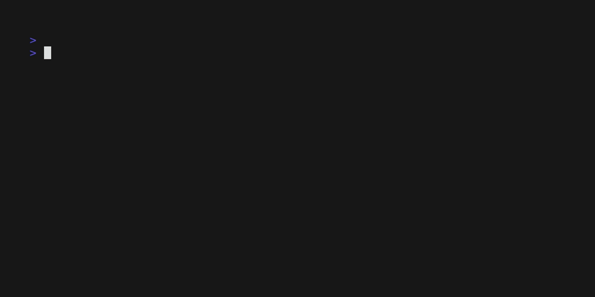

# Cest

**Minimalist C Unit Testing Framework inspired by Jest and Gest.**

[](LICENSE)
[](cest.h)
[]()
[]()

Cest is a lightweight, **header-only** testing framework for C and related languages. It brings the expressive syntax of modern JavaScript and Go testing tools to C-family languages.

---

## Supported Languages

| Language | Extension | Compiler | Full Support |
|----------|-----------|----------|:------------:|
| **C** | `.c` | `gcc`, `clang` | Yes |
| **C++** | `.cpp` | `g++`, `clang++` | Yes |
| **Objective-C** | `.m` | `clang -x objective-c` | Yes |
| **Objective-C++** | `.mm` | `clang++ -x objective-c++` | Yes |

---

## Quick Start

### C

```c
#include "cest.h"

int main() {
    describe("Math Suite", {
        it("sums numbers correctly", {
            expect(1 + 1).toEqual(2);
        });
    });

    return cest_result();
}
```

```bash
gcc -std=c11 -o test test.c
./test
```

### C++

```cpp
#include "cest.h"
#include <string>

int main() {
    describe("String Suite", {
        it("compares strings", {
            std::string s = "hello";
            expect(s).toEqual("hello");
        });
    });

    return cest_result();
}
```

```bash
g++ -std=c++11 -o test test.cpp
./test
```

### Objective-C

```objc
#import "cest.h"

int main() {
    describe("ObjC Suite", {
        it("works with id", {
            id obj = (id)0x1234;
            expect(obj).toBeTruthy();
        });
    });

    return cest_result();
}
```

```bash
clang -x objective-c -o test test.m -lobjc
./test
```

---

## Demo





---

## Features

- **Header-Only**: Just include `cest.h` in your project.
- **Multi-Language**: Native support for C, C++, Objective-C, and Objective-C++.
- **No Dependencies**: Zero external libraries (not even `-lm`).
- **Modern Syntax**: Uses `describe`, `it`, and `expect` for readable tests.
- **Colorized Output**: Instant visual feedback in your terminal.
- **Type-Safe**: Uses `_Generic` (C11) or function overloading (C++) for automatic type handling.
- **Multi-file Support**: Compile multiple `.c` test files and Cest unifies results.

---

## Available Matchers

| Matcher | Description |
|:---|:---|
| `toBe(x)` / `toEqual(x)` | Checks value equality or identity. |
| `toBeTruthy()` | Checks if the value is "truthy". |
| `toBeFalsy()` | Checks if the value is "falsy" or null. |
| `toBeNull()` | Checks if a pointer is `NULL` or `nil`. |
| `toBeGreaterThan(x)` | Checks if the value is greater than `x`. |
| `toBeLessThan(x)` | Checks if the value is less than `x`. |
| `toContain(substring)` | Checks if a string contains a sub-string. |
| `toBeCloseTo(val, prec)` | Compares doubles with specific precision. |

---

## Building Examples

```bash
make              # Build all examples to build/
make run          # Build and run all examples
make clean        # Clean build directory
```

---

## Documentation

Detailed documentation is available in multiple languages:

- [Brazilian Portuguese (docs/pt-br)](docs/pt-br/overview.md)
- [English (docs/us-en)](docs/us-en/overview.md)

---

## License

This project is licensed under the [BSD-3 Clause License](LICENSE).
